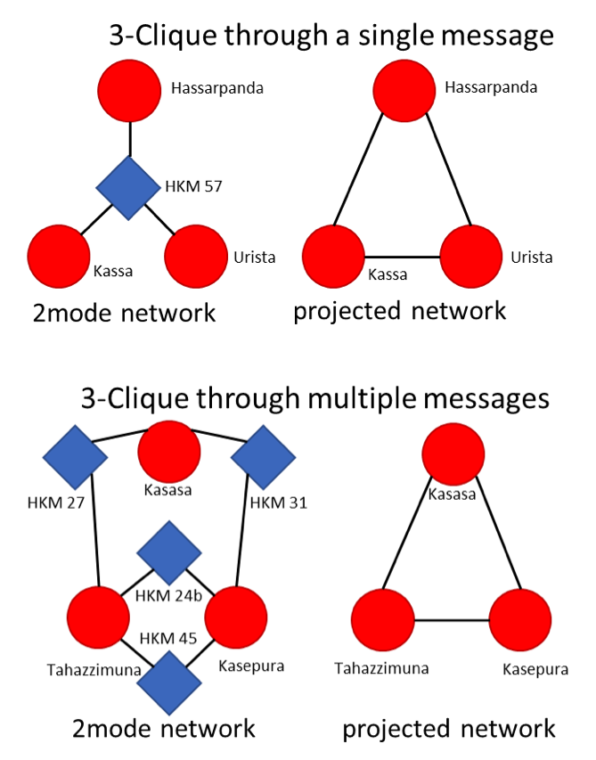

# Case Study: Hittite Letters
In this section we analyze data from a corpus of clay tablets recovered primarily from sites in Late Bronze Age Anatolia (Hoffner 2009). The Late Bronze Age in Anatolia and the greater Eastern Mediterranean was a period of unprecedented trans-regional interaction. From 1500 B.C.E. to 1200 B.C.E., Akkadian cuneiform served as a _lingua franca_ for communication between far-flung kingdoms: Hatti in central Anatolia, Arzawa in western Anatolia, Mycenae in Greece, Alashiya in Cyprus, Mitanni in northern Mesopotamia, Babylonia in southern Mesopotamia, and Egypt in north Africa (Moran 1992; Cline 2014). The kings of these states frequently sent letters to one another in the form of clay tablets, dealing with topics like trade, tribute, marriage, war, and political intrigue (Moran 1992; Hoffner 2009). In rare cases, archaeologists have recovered preserved caches of these texts, providing an unparalleled yet imperfect window onto these ancient social networks.

Information recovered from such tablet caches is readily represented as a bipartite network, in which individuals or polities are connected associated to one another by the particular tablets that mention them. Such data are often converted to a one mode network by treating such co-occurences as evidence for a social tie (Tobler and Wineburg 1971; Cline 2014 **pp**; see Munson and Macri **xx** for the same in a related dataset), but such an approach ignores potentially critical information such as the length and content of the message or the location where it was recovered. Below we explore how best to preserve information from two-mode networks in a one-mode projection, given the particular nature of correspondence-based data.

## The Dataset
We analyze a dataset of 101 place names mentioned across 165 clay tablets written in the Hittite language recovered from _5_ archaeological sites primarily located in the central Anatolian plateau. After Tobler and Wineburg (1971), we conflate geographic and social distance by treating these correspondence data as proxies for _any_ kind of social interaction in the past. Using this broad definition helps out analysis to be more robust to archaeological uncertainty and the false precision that may result from uncritically categorizing particular references into types like "warfare" or "diplomacy".

## Projection
We explore three methods for projecting the two-mode network of sites and tablets into a one-mode network of sites. The _binary_ method simply creates an unweighted one-mode network based on the presence or absence of two sites co-occuring in a tablet.

The _sum_ method weights these ties by the total amount of co-occurrances.

The _Newman_ method also uses the amount of co-occurrences, but down weights ties that pass through more highly-connected second-mode nodes.

None of these methods is ideal in all situations. Their validity is contingent on the nature of the dataset and the assumptions a researcher makes about it. For example, if two sites are mentioned in the same text we can assume that those sites have a greater probability of having interacted in the past then then two sites that do not co-occur in a text; but if one pair of sites co-occur once and another pair co-occur twice, how meaningful is this difference.

Ultimately, the question comes down to how well you trust your data. If you have reason to believe that your sample is very noisy or biased, then you might be safer using a simple binary projection approach. You can use more complex techniques like sum, Newman, or a hierarchical Newman to preserve much of the information from the original two-mode network, _but if much of the information in the original two-mode network is noise then the added value of using such advanced techniques is negligible_.

wih the sum we get a very ineresting idea of the structure, with newman we're reminded that some of those structures, like the western anatolian one, are based on very few tablets.  Greater clustering coefficient in sum projection, less in newman.

## Community Detection
In addition to the kinds of international correspondences described above, several of these tablets record domestic affairs within the Hittite state and its vassal kingdoms. This distinction is typically apparent in the stated relationship between the sender and receiver of a message; international correspondences are made between "brothers" (i.e. egalitarion) and domestic correspondences are made between "fathers" and "sons" (i.e. hierarchical). This mixed structure is both an object of study and a source of bias in this analysis.

Cliques are groups of nodes which possess all possible ties among that group. Bicliques are cliques in a bipartite network. Due to the bipartite nature, cliques must be defined through the second mode of the two-mode network; however, the definition is often the same as that of cliques, just with an extra data layer between the grouped nodes of interest.

