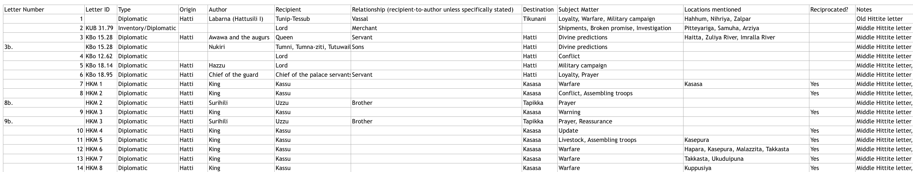
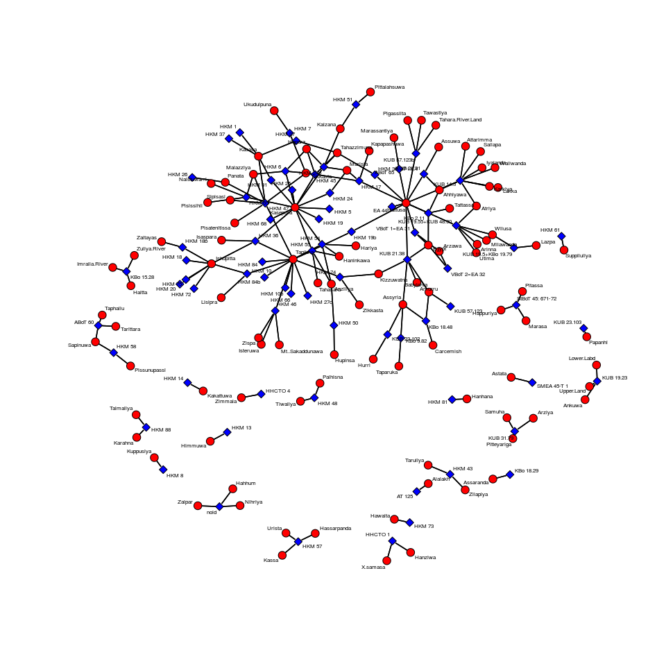
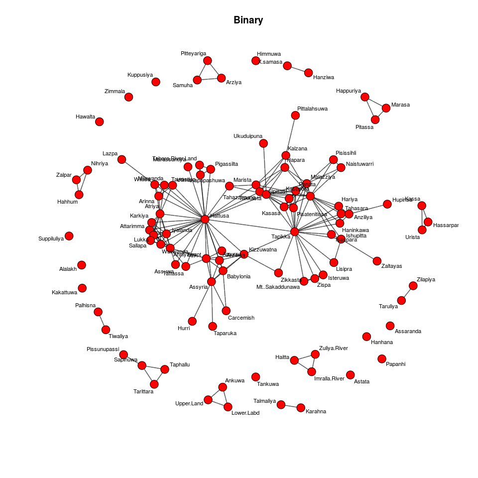
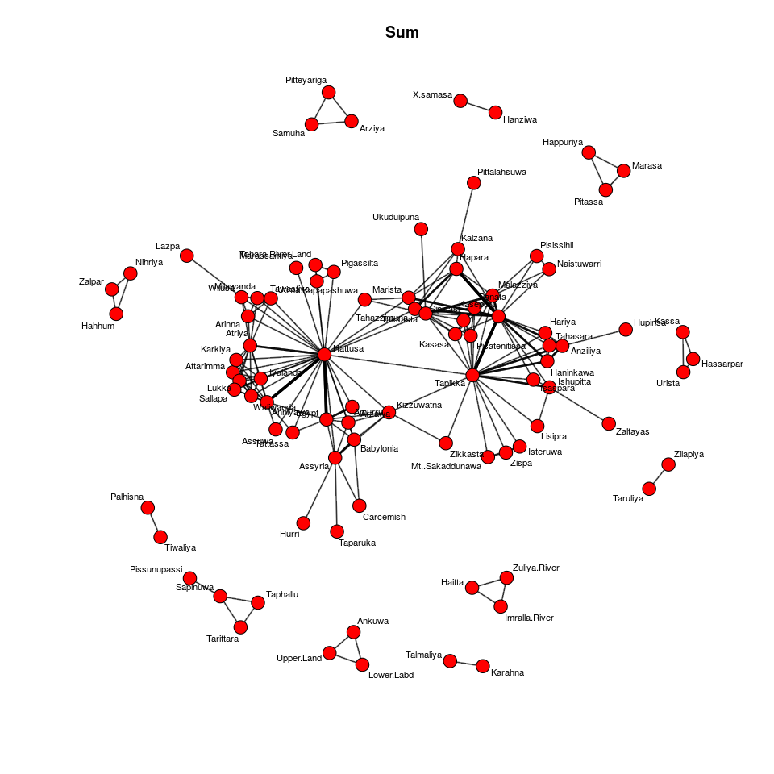
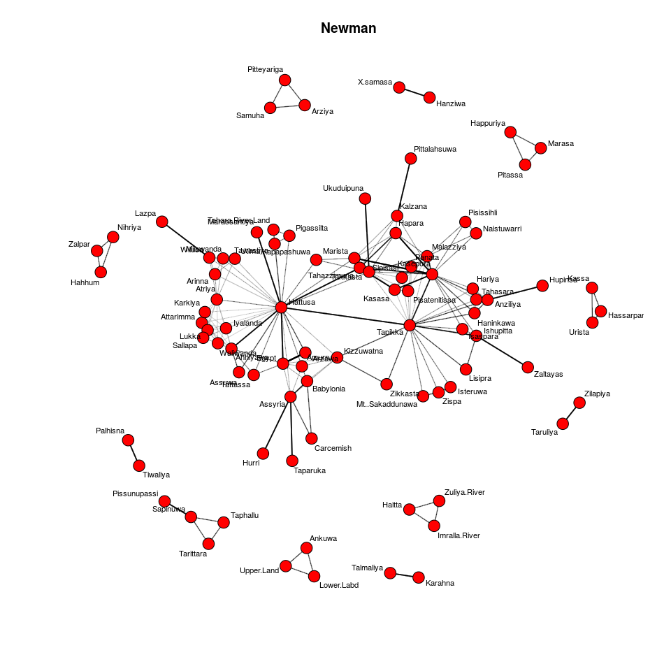
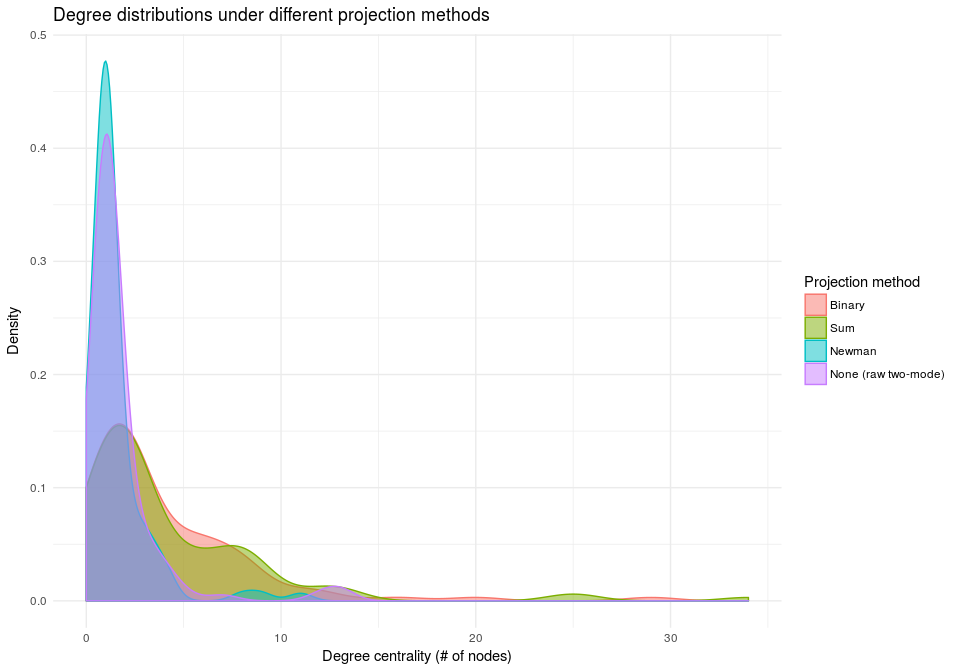
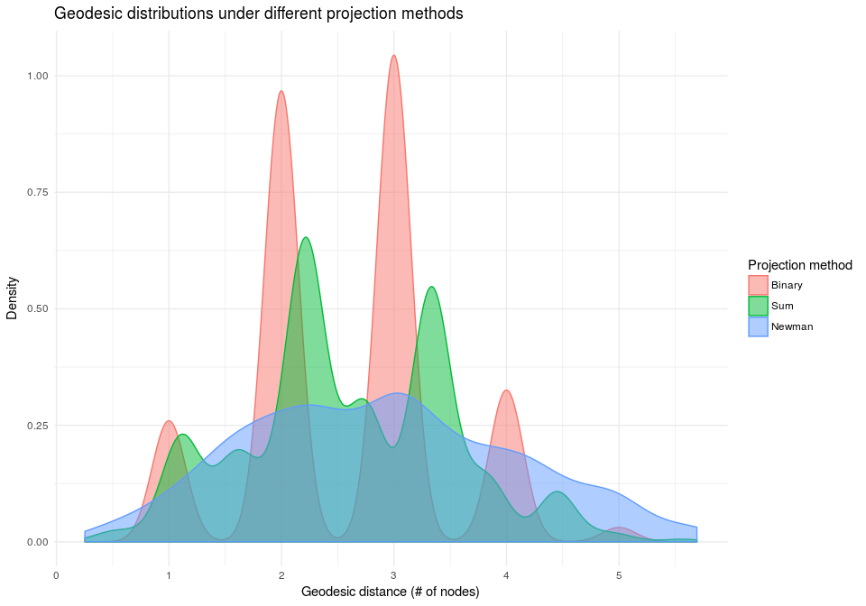

# Exploratory analysis of Hittite correspondence data
Nick Gauthier  
October 8, 2015  

This document presents some exploratory analyses of a dataset coded from a corpus of correspondences between Hittite cities in Bronze Age Anatolia. Data were collected from translations in [Letters from the Hittite Kingdom](https://books.google.com/books/about/Letters_from_the_Hittite_Kingdom.html?id=7B2y1lSFMFAC). 

##Two-Mode Network
Let's start by looking at a two mode network developed by recording all place names mentioned in each tablet in the corpus described above. The nodes in this network thus represent either sites or tablets.  
  


  
  
  Let's start by importing a pre-prepared adjacency matrix derived from this datset. In this matrix, the rows represent tablets and the columns sites. A cell contains a '1' if that particular location is mentioned in that particular tablet, and contains 'NA' otherwise. Looking at the dimensions of the matrix, we see that there are 101 sites mentioned across 165 tablets. 
  
  After importing this matrix, we create a binary network by setting all null cells to 0.


```r
dat <- read.csv('Two Mode-Table.csv', row.names = 1) # import data and use the values in column 1 as row names
dat[is.na(dat)] <- 0  # binarize the network

## not run
# Make sure that the rows of the matrix contain the first mode and the columns the second mode.
dat <- t(dat) # transpose the matrix if not
```


Now let's use the [R-package **tnet**](https://cran.r-project.org/web/packages/tnet/tnet.pdf) to treat this matrix as a two-mode network, and **sna** for network plotting and analysis functions. **igraph** must also be installed as it is one of **tnet**'s dependencies. Also load the packages **ggplot2** and **reshape2** for aditional plotting functions and **magrittr** for piping functions to enhance code readability.


```r
library(tnet)
library(sna)
library(magrittr)
library(ggplot2)
library(reshape2)
```
  
Plot the raw two-mode data, with the first mode in red and the second in blue.
  

```r
gplot(dat, gmode = 'twomode', usearrows = F, displayisolates = F, displaylabels = T,label.cex = .5)
```

<!-- -->
  
  Let's use **tnet** to create a binary two-mode network.
  

```r
mode2 <- as.tnet(dat, type = 'binary two-mode tnet')
```


##One-mode networks
Now we can use **tnet** to *project* the two-mode data into a one-mode format using the **projecting_tm()** function. There are three different projection methods we can use by changing the **method** argument to **projecting_tm()**. The *binary* method simply creates an unweighted one-mode network. The *sum* method weights the ties by the number of co-occurrances. The *Newman* method starts with the number of co-occurrences but downweights ties that pass through more highly-connected second-mode nodes. [Click here for more information on these projection methods](http://toreopsahl.com/tnet/two-mode-networks/projection/).
 
 Let's define a function to create **sna**-compatible adjacency matrices from a **tnet** edgelist, and apply that to projected one-mode networks created using each of the above methods.


```r
sna.format <- function(net){
     net <- as.matrix(net)
     N <- max(c(net[,"i"],net[,"j"]))
     g <- matrix(data=0, nrow=N, ncol=N)
     g[net[,c("i","j")]] <- net[,"w"]
     g <- as.sociomatrix.sna(g)
}

mode1.bin <- projecting_tm(mode2, method = 'binary') %>% sna.format
mode1.sum <- projecting_tm(mode2, method = 'sum') %>% sna.format
mode1.new <- projecting_tm(mode2, method = 'Newman') %>% sna.format
```

<!-- --><!-- --><!-- -->


##Node Centrality
###Degree
How do the different projection methods impact node-level statistics? Let's look by calculating the degree centrality of the raw two-mode networks and the three projected one-mode networks and comparing their distributions. [Click here for more information on how to think about centrality in two-mode networks](http://toreopsahl.com/tnet/two-mode-networks/node-centrality/).

```r
degrees <- cbind(degree(mode1.bin, gmode = 'graph'),
                degree(mode1.sum, gmode = 'graph'),
                degree(mode1.new, gmode = 'graph'), 
                degree_tm(mode2)[,2]) %>% melt
```

<!-- -->

Network-level degree centrality measures appear to very sensitive to the projection methods used. The raw two-mode and Newman degree distributions are very similar, with more than 40% of the nodes connected to < 2 other nodes. The distributions only diverge when it comes to isolated nodes. This is to be expected. From the link above we see that "the only difference between this method [Newman] and the two-mode degree is single authored papers [i.e. isolates]. These are excluded in the first and included in the second method."
 
 The degree distributions of one-mode networks generated using binary and sum methods are similar for nodes with low degree centrality, but the distributions diverge as degree centrality increases (i.e. the sum degree distribution has a fatter tail).

###Geodesic Distance
Now let's look at the distribution of shortest path lengths across the weighted one-mode networks derived from each projection method. [Click here for more information](http://toreopsahl.com/tnet/two-mode-networks/shortest-paths/).


```r
distances <- cbind(distance_tm(mode2, projection.method = 'binary') %>% lower.tri.remove %>% c,
                  distance_tm(mode2, projection.method = 'sum') %>% lower.tri.remove %>% c,
                  distance_tm(mode2, projection.method = 'Newman') %>% lower.tri.remove %>% c) %>% melt
```

<!-- -->
These three distributions are not directly comparable, as the binary-projected network is unweighted and can only have integer distances. Accounting for this discrepency, there appears to be much more similarity between these distributions than between the degree distributions. Although this may just be an artifact of this particular dataset, the geodesic distribution appears to be more robust to the choice of projection than the degree distribution.
