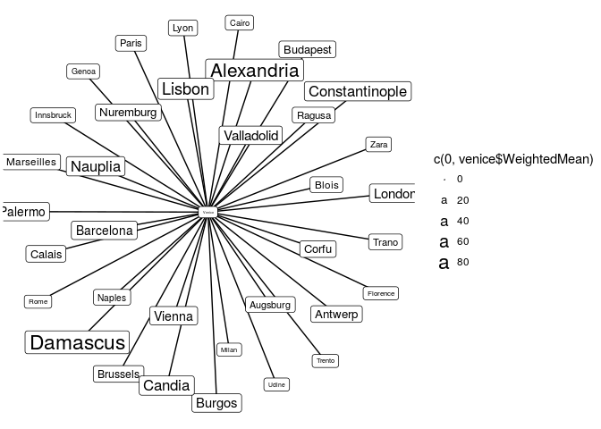

# Venice Correspondence Network


```r
library(tidyverse)
library(igraph)
library(ggraph)
```

# Venice News Elasticity

```r
venice <- read_csv('venice_news.csv')
glimpse(venice)
```

```
## Observations: 35
## Variables: 8
## $ City         <chr> "Alexandria", "Antwerp", "Augsburg", "Barcelona",...
## $ Cases        <int> 266, 83, 110, 171, 345, 138, 317, 79, 41, 62, 56,...
## $ NormalCases  <int> 19, 13, 19, 16, 53, 24, 39, 13, 13, 15, 16, 46, 3...
## $ MaxDays      <int> 89, 36, 21, 77, 27, 35, 35, 42, 10, 32, 81, 81, 4...
## $ WeightedMean <int> 65, 20, 11, 22, 14, 16, 18, 27, 7, 18, 38, 37, 19...
## $ Normal       <int> 55, 16, 12, 19, 10, 10, 19, 27, 8, 14, 33, 34, 15...
## $ Minimum      <dbl> 17.0, 8.0, 5.0, 8.0, 4.5, 9.0, 7.0, 11.0, 3.0, 12...
## $ Ratio        <int> 323, 200, 240, 237, 222, 111, 271, 245, 266, 116,...
```


```r
venice.net <- venice %>%
     mutate(From = 'Venice') %>%
     select(From, City:Ratio) %>%
     graph_from_data_frame
venice.net
```

```
## IGRAPH DN-- 36 35 -- 
## + attr: name (v/c), Cases (e/n), NormalCases (e/n), MaxDays (e/n),
## | WeightedMean (e/n), Normal (e/n), Minimum (e/n), Ratio (e/n)
## + edges (vertex names):
##  [1] Venice->Alexandria     Venice->Antwerp        Venice->Augsburg      
##  [4] Venice->Barcelona      Venice->Blois          Venice->Brussels      
##  [7] Venice->Budapest       Venice->Burgos         Venice->Cairo         
## [10] Venice->Calais         Venice->Candia         Venice->Constantinople
## [13] Venice->Corfu          Venice->Damascus       Venice->Florence      
## [16] Venice->Genoa          Venice->Innsbruck      Venice->Lisbon        
## [19] Venice->London         Venice->Lyon           Venice->Marseilles    
## + ... omitted several edges
```
venice


```r
ggraph(venice.net) +
     geom_edge_link() +
     geom_node_point(aes(size = c(0,venice$WeightedMean))) +
     geom_node_label(aes(label = name, size = c(0, venice$WeightedMean))) +
     theme_void() +
     coord_fixed()
```

```
## Using `nicely` as default layout
```

<!-- -->

```r
V(venice.net)
```

```
## + 36/36 vertices, named:
##  [1] Venice         Alexandria     Antwerp        Augsburg      
##  [5] Barcelona      Blois          Brussels       Budapest      
##  [9] Burgos         Cairo          Calais         Candia        
## [13] Constantinople Corfu          Damascus       Florence      
## [17] Genoa          Innsbruck      Lisbon         London        
## [21] Lyon           Marseilles     Milan          Naples        
## [25] Nauplia        Nuremburg      Palermo        Paris         
## [29] Ragusa         Rome           Trano          Trento        
## [33] Udine          Valladolid     Vienna         Zara
```

